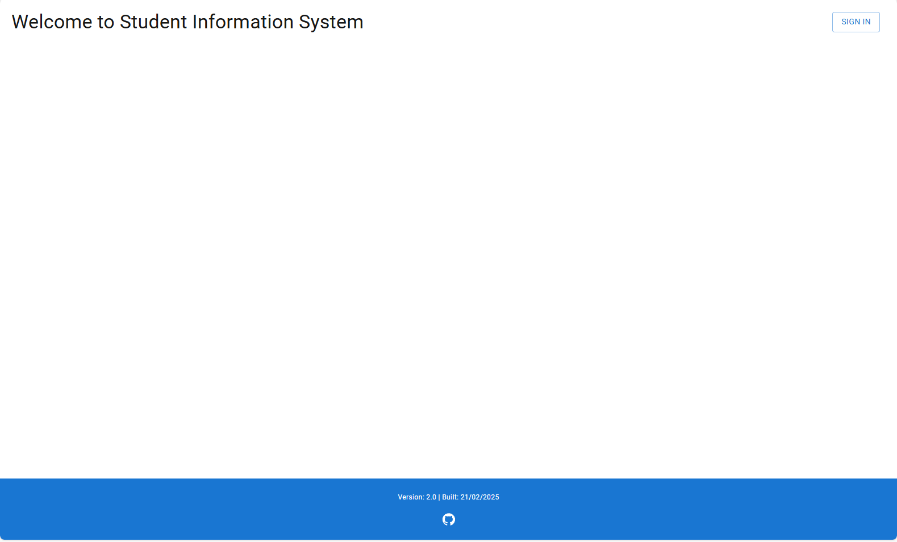
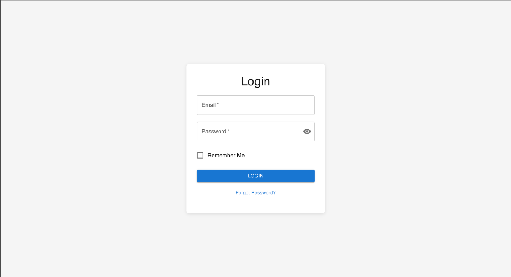
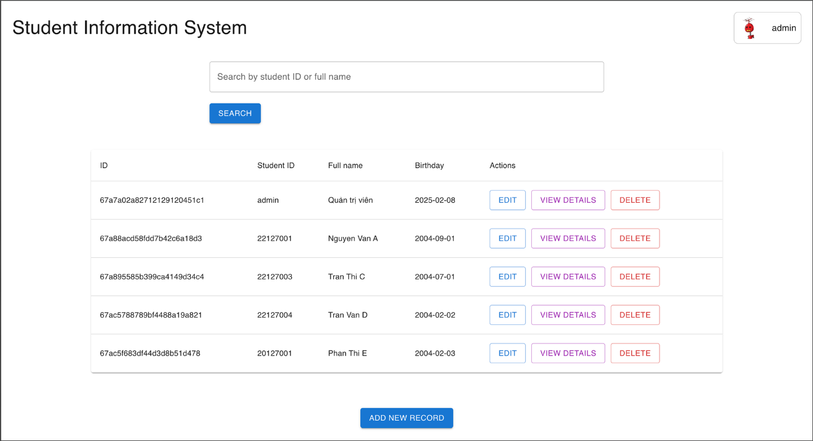
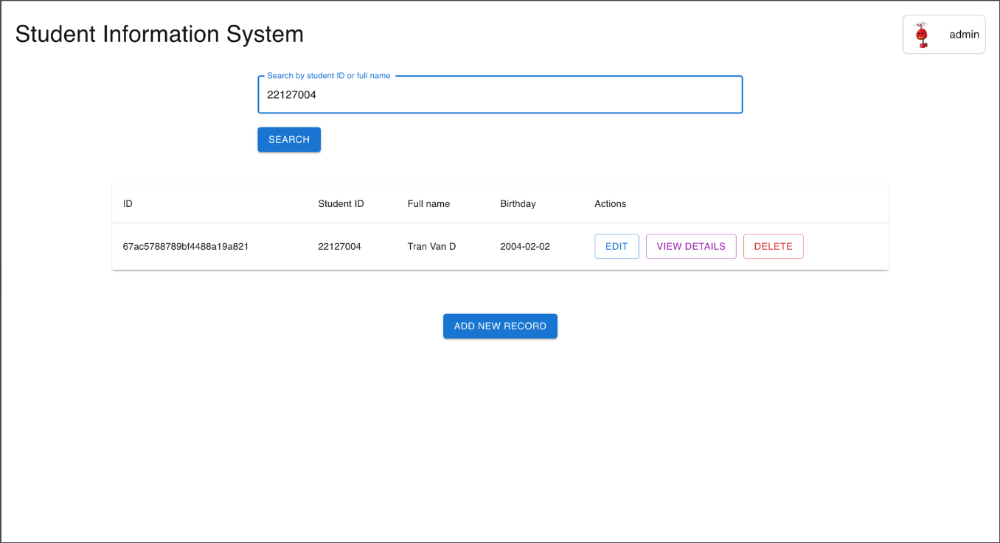
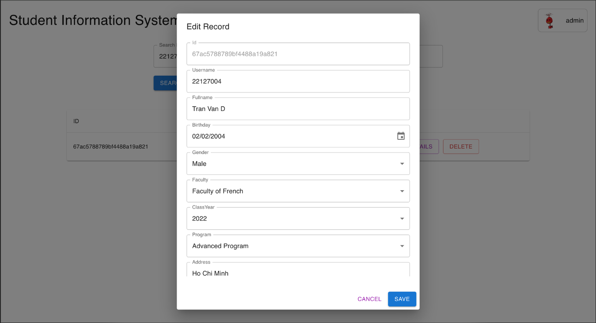
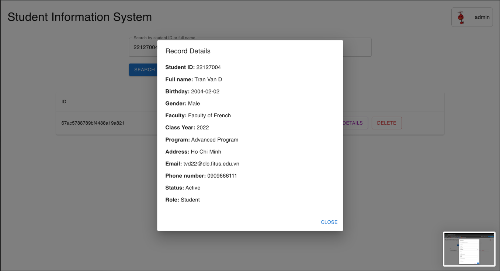
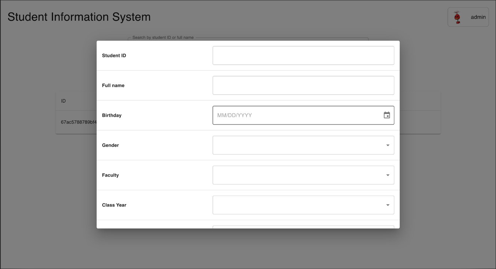
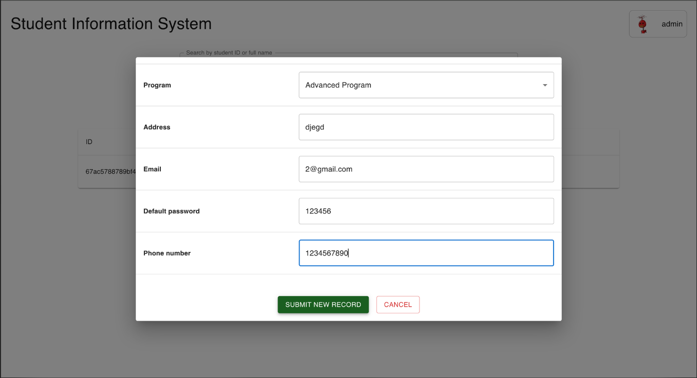
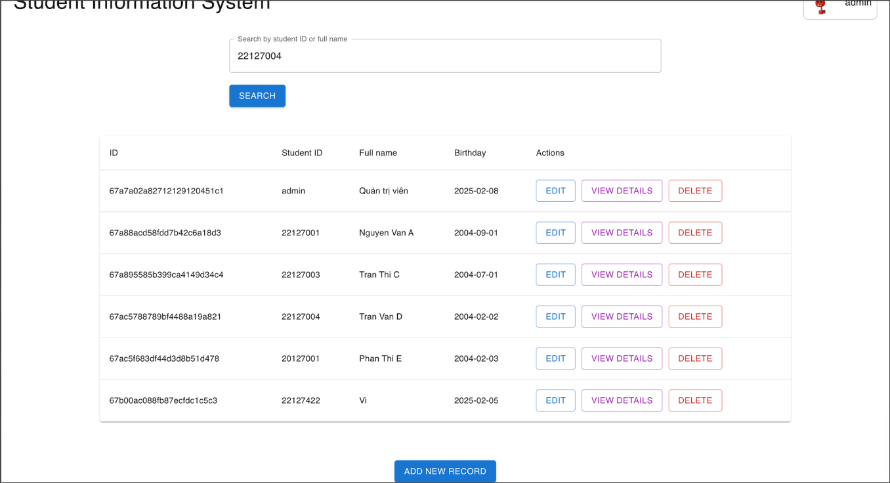

# csc13010 - Student Information System Application

## Overview

This repository contains the code for a very basic student information system (SIS) as web application. The application separates the user interface (client) from the data management and business logic (server).

The system manages student data, including information such as:

- Student ID
- Full Name
- Date of Birth
- Gender
- Faculty/Department
- Class
- Program
- Address
- Email
- Contact Phone Number
- Student Status

## Features

- **Authentication/Authorization:** Allow user to login and recover password through email. The system includes 3 roles for authorization: `ADMIN`, `STUDENT`, `TEACHER`.
- **Student Management:** Provide CRUD operations for student records. This includes adding new students, deleting students, updating student information, and viewing student details.
- **Search Functionality:** Allow searching for students by full name or Student ID (MSSV).
- **Data Validation:** Implement input validation for key fields such as email, phone number, faculty, and student status.

## Validation Rules (Backend)

The backend API enforces the following validation rules:

- **Email:** Checks for a valid email format (using regular expression).
- **Phone Number:** Validates that the phone number matches a specific format (using a regular expression & length check).
- **Faculty:** Ensures that the entered faculty matches one of the allowed values:
    - Faculty of Law (FL)
    - Faculty of Business English (FBE)
    - Faculty of Japanese (FJPN)
    - Faculty of French (FFR)
- **Student Status:** Validates that the entered status matches one of the allowed values:
    - Active
    - Graduated
    - Leave (Left the program)
    - Absent (On Leave)
- **Program:** Ensures that the entered program matches one of the allowed values:
    - High Quality Program (HQP)
    - Formal Program (FP)
    - Advanced Program (AP)

## Technologies

- **Frontend:**
    - Next.js (TypeScript)
- **Backend:**
    - NestJS (TypeScript)
    - Mongoose
    - Docker/Docker Compose
- **Database:** MongoDB
- **Node.js:** Node 22 (specified in `.nvmrc`)
- **Package Manager:** PNPM
- **Operations:** Husky (commitlint, ESLint), Prettier, Github Actions (CI), Vercel/Render (CD)

## Prerequisites

Before you can run this application, you'll need to have the following installed:

- **Node.js:** Make sure you have Node.js version 22 or higher installed. It's recommended to use `nvm` (Node Version Manager) for managing Node.js versions.
- **PNPM:** You'll need a package manager to install dependencies. `pnpm` comes with Node.js.
- **MongoDB:** Install and configure database server in `.env` following `.env.example`.

## Setup and Installation

Follow these steps to get the application up and running:

1.  **Clone the repository:**

    ```
    git clone https://github.com/ntkwan/csc13010-student-information-system.git
    cd csc13010-student-information-system
    ```

2.  **Install Dependencies:**

    - **Client:**
        ```
        cd client
        pnpm install
        ```
    - **Server:**
        ```
        cd ../server
        pnpm install
        ```

3.  **Configure the Database:**

    - The `docker-compose.yml` file inside `server` is allowed to run docker container of MongoDB in case of local development. However, [MongoDB Compass](https://www.mongodb.com/products/tools/compass) is suitable for production.
    - Update the database connection settings in the server `.env` file (`server/.env.example` for a template). Specify the database host, port, username, and password.

4.  **Environment Variables:**
    - Create `.env` files in both the `client` and `server` directories.
    - Define the necessary environment variables (e.g., API endpoint, database connection string, API keys). See `.env.example` for a template.

## Running the Application

1.  **Start the Server:**

    ```
    cd server
    pnpm run start:dev
    ```

    or

    ```
    cd server & docker build -t sis-backend .
    docker run [IMAGE_ID]
    ```

    To find `IMAGE_ID`, use `docker images` and looking for image named `sis-backend`
    After starting the server, it is now accessible in your browser at `http://localhost:[port]` (e.g., `http://localhost:8080`)

2.  **Start the Client:**

    ```
    cd client
    pnpm run dev  # or yarn start
    ```

    The client application should now be accessible in your browser at `http://localhost:[port]` (e.g., `http://localhost:3000`).

## Deployment

The demo client and server are currently deployed at [Vercel](csc13010-student-information-system.vercel.app) and [Render](https://csc13010-student-information-system.onrender.com), respectively.

## Documentation

Find more API endpoints description at [Render](https://csc13010-student-information-system.onrender.com/docs).

## Usage

Once the application is running, you can interact with it through the dashboard menu. The menu will provide options for:

- Adding a new student
- Deleting a student
- Updating student information
- Searching for students

## Screenshots

### Landing page



### Login page



### Menu



### Search a record



### Edit a record



### View a record



### Add a record





## Code convention

This project uses [ESLint](https://eslint.org/) and [Prettier](https://prettier.io/) for code formatting and linting. Please ensure your code adheres to the project's style guidelines. The Git hooks (using Husky) will automatically run these tools before each commit.

This project uses a conventional commit message format.

## Contributing

Contributions are welcome! To contribute to this project, please follow these steps:

1.  Fork the repository.
2.  Create a new branch for your feature or bug fix.
3.  Make your changes and commit them with clear, descriptive commit messages.
4.  Submit a pull request.
